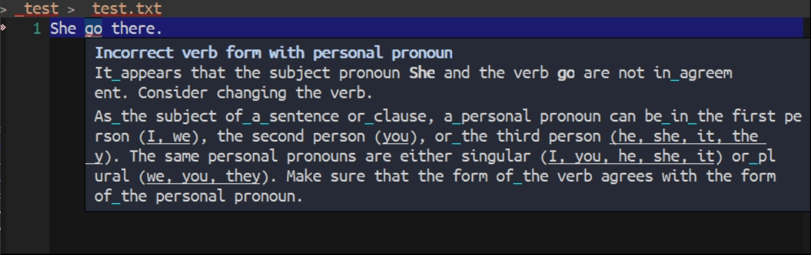
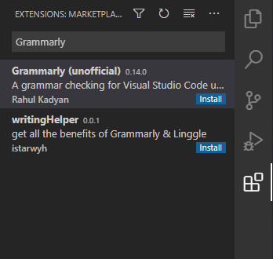
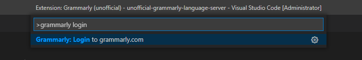
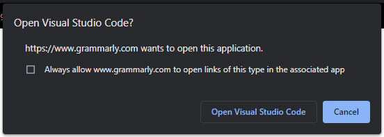
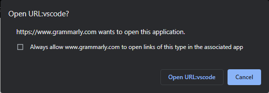
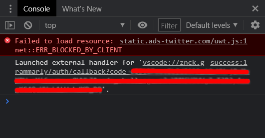
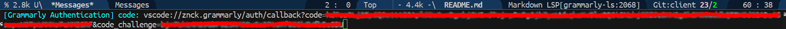
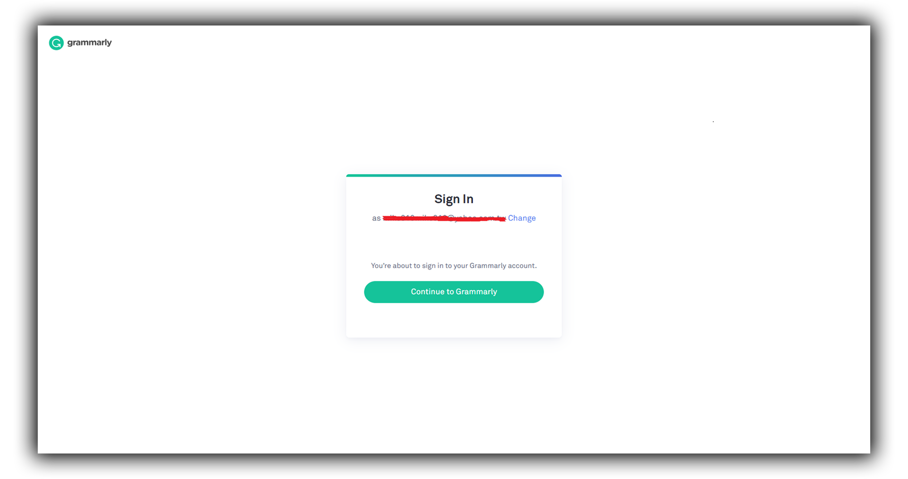

[](https://www.gnu.org/licenses/gpl-3.0)
[](https://jcs-emacs.github.io/jcs-elpa/#/lsp-grammarly-un)

# lsp-grammarly-un

[](https://github.com/emacs-grammarly/lsp-grammarly-un/actions/workflows/test.yml)
[](https://github.com/emacs-grammarly/lsp-grammarly-un/actions/workflows/activate.yml)

`lsp-mode` client leveraging [unofficial-grammarly-language-server](https://github.com/znck/grammarly).

<p align="center"></p>

<!-- markdown-toc start - Don't edit this section. Run M-x markdown-toc-refresh-toc -->
**Table of Contents**

- [lsp-grammarly-un](#lsp-grammarly-un)
  - [💾 Quickstart](#💾-quickstart)
  - [📇 Commands](#📇-commands)
  - [🔧 Configuration](#🔧-configuration)
  - [📝 Roadmap](#📝-roadmap)
  - [💸 Using a Paid Grammarly Account](#💸-using-a-paid-grammarly-account)
    - [🔍 Method 1: Login with VSCode (easier)](#🔍-method-1-login-with-vscode-easier)
    - [🔍 Method 2: Login with Emacs (a bit complicated)](#🔍-method-2-login-with-emacs-a-bit-complicated)
    - [Authentication from Grammarly website](#authentication-from-grammarly-website)
  - [🛠️ Contribute](#🛠️-contribute)
    - [🔬 Development](#🔬-development)
  - [⚜️ License](#⚜️-license)

<!-- markdown-toc end -->

## 💾 Quickstart

```el
(use-package lsp-grammarly-un
  :ensure t
  :hook (text-mode . (lambda ()
                       (require 'lsp-grammarly-un)
                       (lsp))))  ; or lsp-deferred
```

## 📇 Commands

List of commands interact with `language server` and `Grammarly.com`.

| Commands                       | Description                                                                  |
|:-------------------------------|:-----------------------------------------------------------------------------|
| lsp-grammarly-un-login         | Login to Grammarly.com                                                       |
| lsp-grammarly-un-logout        | Logout from Grammarly.com                                                    |
| lsp-grammarly-un-check-grammar | Start grammarly check for currnet document (buffer)                          |
| lsp-grammarly-un-stop          | Stop grammarly checker from current document (buffer)                        |
| lsp-grammarly-un-stats         | Log out current document status, `score`, `readability`, `words count`, etc. |

## 🔧 Configuration

`lsp-grammarly-un` supports following configuration. Each configuration is described in
detail in [Grammarly Settings](https://github.com/znck/grammarly#extension-settings).

* `grammarly.autoActivate` via `lsp-grammarly-un-auto-activate`
* `grammarly.audience` via `lsp-grammarly-un-audience`
* `grammarly.dialect` via `lsp-grammarly-un-dialect`
* `grammarly.domain` via `lsp-grammarly-un-domain`
* `grammarly.emotions` via `lsp-grammarly-un-emotions`
* `grammarly.goals` via `lsp-grammarly-un-goals`
* `grammarly.userWords` via `lsp-grammarly-un-user-words`
* `grammarly.overrides` via `lsp-grammarly-un-override`

## 📝 Roadmap

List of todos, but I have not got time to implement these features.

- [ ] Create another package that displays information from [Grammarly.com](https://www.grammarly.com/)
(To display useful information, `score`, `readability`, `word counts`, etc).
- [ ] Implement command `Ignore Grammarly Issue`.
- [ ] Implement `diagnostics` and `severity` for configuration.

## 💸 Using a Paid Grammarly Account

> ***NOTE:** To login, make sure you have package [keytar](https://github.com/emacs-grammarly/keytar)
set up properly. See [keytar#installation](https://github.com/emacs-grammarly/keytar#installation)
for setup instruction.*

You can either login with [vscode-grammarly](https://marketplace.visualstudio.com/items?itemName=znck.grammarly)
using VSCode or hit `M-x lsp-grammarly-un-login`. They both share the same credentials
so you can login with either side.

### 🔍 Method 1: Login with VSCode (easier)

Install VSCode and install extension [vscode-grammarly](https://marketplace.visualstudio.com/items?itemName=znck.grammarly)
from the extension panel.

<p align="center"></p>

Then call command palette (default to <kbd>Ctrl</kbd>+<kbd>Shift</kbd>+<kbd>p</kbd>)
and type to search `grammarly login` command.

<p align="center"></p>

You should see [Grammarly Website](#authentication-from-grammarly-website) and
login with your Grammarly account.

<p align="center"></p>

🎉 Make sure you click on the button `Open Visual Studio Code`. Done! You
can now close VSCode and go back to Emacs!

### 🔍 Method 2: Login with Emacs (a bit complicated)

Hit `M-x lsp-grammarly-un-login` and you should see the Grammarly's website pop out
from your favorite browser. See below [screenshot](#authentication-from-grammarly-website),

After login, click the button `Open URL:vscode`, If you have VSCode installed, then
this button would be `Open Visual Studio Code` instead yet it doesn't matter.

<p align="center"></p>

Then click <kbd>F12</kbd> to open the DevTool window. You should able to see
an URI like the following

<p align="center"></p>

Copy and paste the URI back to Emacs and hit return.

<p align="center"></p>


🎉 Done! Now you should be loggin!

### Authentication from Grammarly website

Login with your Grammarly account (This step does not require VSCode to be
installed)!

<p align="center"></p>

## 🛠️ Contribute

[](http://makeapullrequest.com)
[](https://github.com/bbatsov/emacs-lisp-style-guide)

If you would like to contribute to this project, you may either
clone and make pull requests to this repository. Or you can
clone the project and establish your own branch of this tool.
Any methods are welcome!

### 🔬 Development

To run the test locally, you will need the following tools:

- [Eask](https://emacs-eask.github.io/)
- [Make](https://www.gnu.org/software/make/) (optional)

Install all dependencies and development dependencies:

```sh
$ eask install-deps --dev
```

To test the package's installation:

```sh
$ eask package
$ eask install
```

To test compilation:

```sh
$ eask compile
```

**🪧 The following steps are optional, but we recommend you follow these lint results!**

The built-in `checkdoc` linter:

```sh
$ eask lint checkdoc
```

The standard `package` linter:

```sh
$ eask lint package
```

*📝 P.S. For more information, find the Eask manual at https://emacs-eask.github.io/.*

## ⚜️ License

This program is free software; you can redistribute it and/or modify
it under the terms of the GNU General Public License as published by
the Free Software Foundation, either version 3 of the License, or
(at your option) any later version.

This program is distributed in the hope that it will be useful,
but WITHOUT ANY WARRANTY; without even the implied warranty of
MERCHANTABILITY or FITNESS FOR A PARTICULAR PURPOSE.  See the
GNU General Public License for more details.

You should have received a copy of the GNU General Public License
along with this program.  If not, see <https://www.gnu.org/licenses/>.

See [`LICENSE`](./LICENSE.txt) for details.
